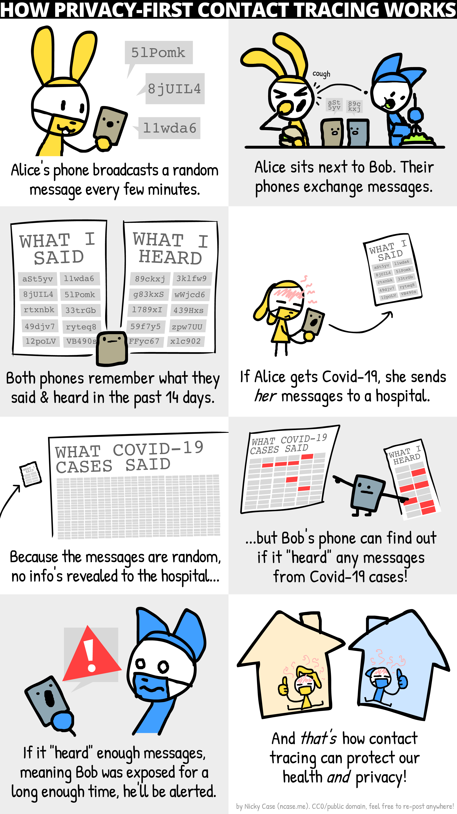

# Engagement Comic

This comic was made by [Nicky Case](https://ncase.me/) to explain how DP-3T works to a wider audience. It is simplified for communication, and not an exact representation of the protocol. For example, the low cost version of the protocol does not allow you to choose the times you upload, whereas the higher cost one using Cuckoo filters does (as per version April 8).

The original URL you can use to easily view the comic is https://ncase.me/contact-tracing/. The whole website is in the public domain, licensed CC-0, and [available on GitHub](https://github.com/ncase/ncase.github.io).

It is also important to note that the comic does display aspects that go beyond our protocol's specifications, such as a risk score being linked to an instruction to stay at home, a toy example of what a local risk calculation algorithm might look like. While our protocol is engineered to protect privacy, and to help protect a wide range of liberties from function creep, it requires thoughtful deployment in an environment with informed and human rights protective policies in order to work for all members of our communities. The comic should therefore not be read as providing policy suggestions beyond the protocol from the DP-3T team.

The original URL of the comic is https://ncase.me/contact-tracing/. The whole website is in the public domain, licensed CC-0, and [available on GitHub](https://github.com/ncase/ncase.github.io).

We would like help *translating the comic*! Please translate (fonts are Patrick Hand and Open Sans) and if you send the files or notify m.veale@ucl.ac.uk, we will upload them to the repo for others to use. If possible, we would appreciate you also licensing your translations CC-0.

There is a folder full of [empty panels](empty_panels) for ease of preparation (thanks[mtwestra](www.github.com/mtwestra)).

## Language versions
[English](en) ([original](https://ncase.me/contact-tracing/)) (CC-0)  
[French](fr) (by Michel "Meï" MANCIER [@MeiVongola](https://twitter.com/meivongola), [GH:MeixDev](github.com/MeixDev)) (CC-0)  
[German](de) (by [@heapspark](https://twitter.com/heapspark)) (CC-0)  
[Spanish](es) (by Vanesa Sánchez Cortés, @VanesaKershawi) (CC-0)  
[Finnish](fi) (by Salu Ylirisku) (CC-0)  
[Brazilian Portuguese](pt-br) (by Chico Camargo [@evoluchico](https://twitter.com/evoluchico), and Yayoi Teramoto [@teramotoki](https://twitter.com/teramotoki))  (CC-0)  
[Catalan](ca) (by Xavi R. Pinteño) (CC-0)  
[Dutch](nl) (by A: GH:[maaike](www.github.com/maaike), B: GH:[BjornW](www.github.com/bjornw); GH:[mtwestra](www.github.com/mtwestra)) (CC-0)  
[Slovak](sk) (by Martin Nagy) (CC-0)  
[Hindi](hi) (currently short version only, by Vikas Dhiman GH:[wecacuee](https://github.com/wecacuee))
[Arabic](ar) (by GH:ezzeldinadel)  
[Italian](it) (by A: GH:therealpecus, B: GH:robypez, C:Sergio Guida, D:Alberto di Meglio - we did not have Italian, and then lots of translations came before we could upload. Thanks all) (CC-0)  
[Norwegian](no) (by Johannes Brodwall)

## 1-page version
Nicky has also created a one-page version, with fewer panes and more simplified content, which, like the others, is totally free for journalists and others to reuse, as it is CC-0. This has less detail on the protocol than the larger versions so please refer to both if you are looking to adapt it for a newspaper article or similar.

